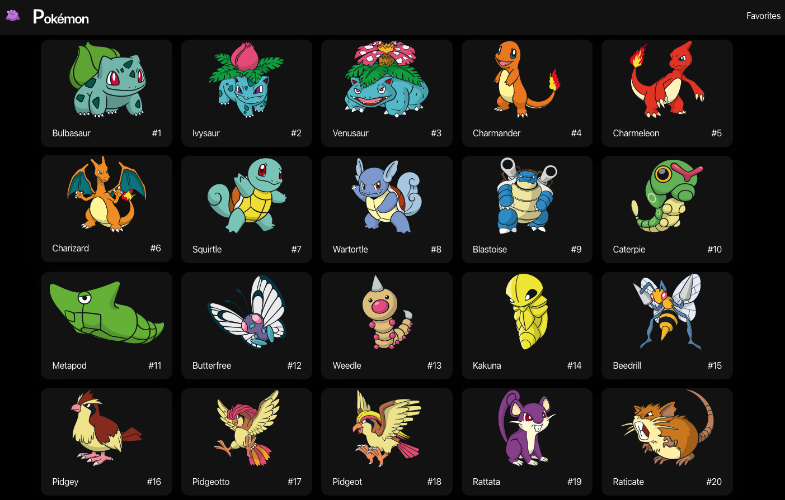
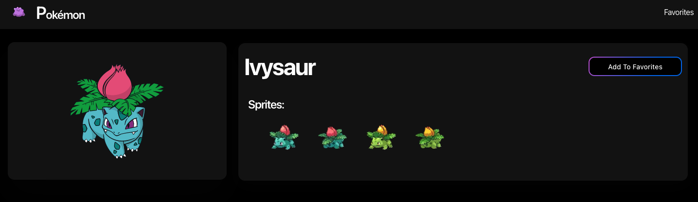
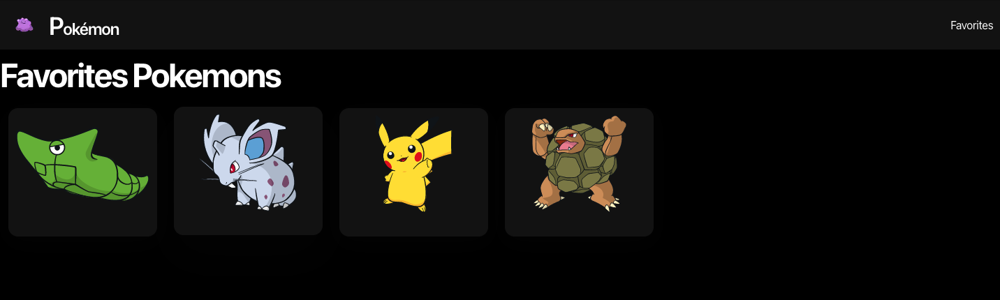

This is a [Next.js](https://nextjs.org/) project bootstrapped with [`create-next-app`](https://github.com/vercel/next.js/tree/canary/packages/create-next-app).

This is a page where you can search pokemons and add them to favorites.

## Getting Started

First, run the development server:

```bash
npm run dev
# or
yarn dev
# or
pnpm dev
```

Open [http://localhost:3000](http://localhost:3000) with your browser to see the result.

## Deploy

Deployed on [Vercel](https://vercel.com/)

This project is part of the course [Next.js: El framework de React para producción
](https://www.udemy.com/course/nextjs-fh/) by Fernando Herrera.

## Screenshots




